# Code Scanning C# Tutorial

Welcome to the Code Scanning C# Tutorial! This tutorial will take you through how to set up GitHub Advanced Security's Code Scanning, as well as interpret results that it may find. The following repository contains cross-site scripting vulnerabilities for demonstration purposes.

## Introduction

Code Scanning is a feature that you use to analyze the code in a GitHub repository to find security vulnerabilities and coding errors. Any problems identified by the analysis are shown in GitHub.

You can use Code Scanning with CodeQL, a semantic code analysis engine. CodeQL treats code as data, allowing you to find potential vulnerabilities in your code with greater confidence than traditional static analyzers.

This tutorial will use CodeQL analysis with Code Scanning in order to search for vulnerabilities within your code. 

## Instructions

Fork this repo

 
  
Begin by [forking this repo](https://docs.github.com/en/free-pro-team@latest/github/getting-started-with-github/fork-a-repo).

Enable Code Scanning

 

#### Security tab

Click on the `Security` tab.

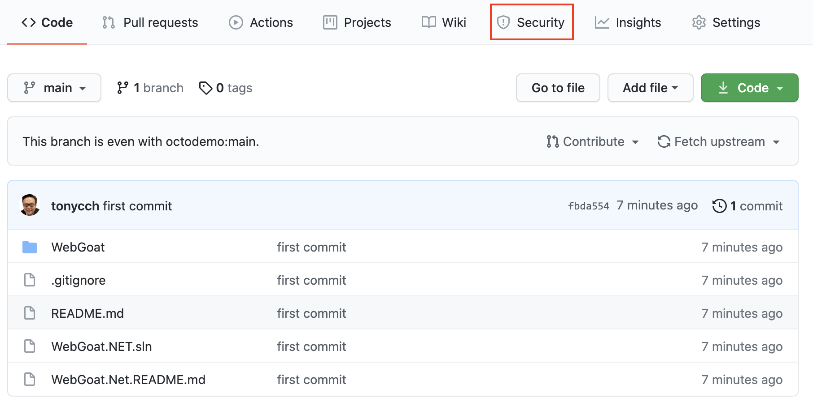

#### Set up code scanning

Click `Set up code scanning`.

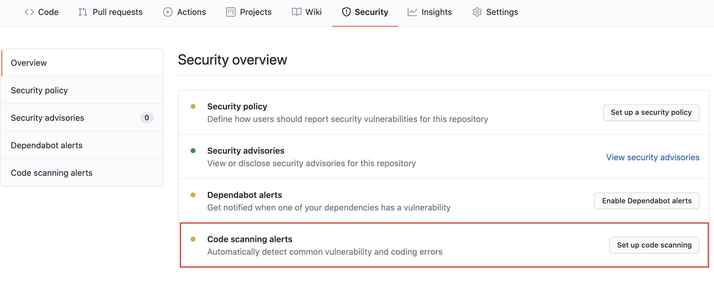

#### Setup Workflow

Click the `Setup this workflow` button by CodeQL Analysis.

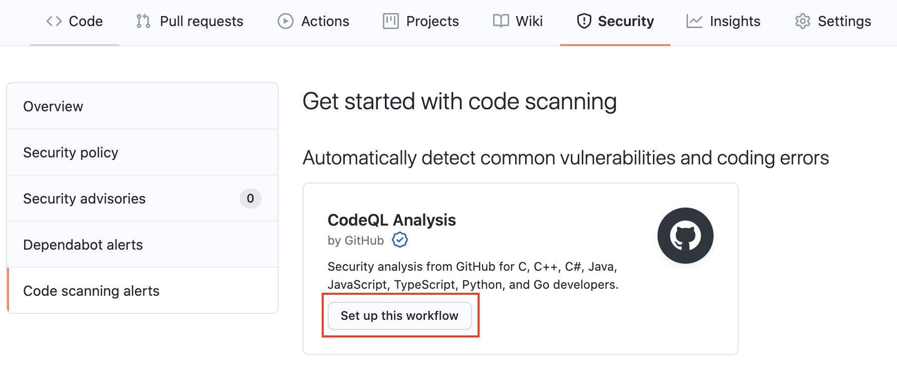

This will create a GitHub Actions Workflow file with CodeQL already set up. Since Java is a compiled language you will need to setup the build in later steps. See the [documentation](https://docs.github.com/en/free-pro-team@latest/github/finding-security-vulnerabilities-and-errors-in-your-code/running-codeql-code-scanning-in-your-ci-system) if you would like to configure CodeQL Analysis with a 3rd party CI system instead of using GitHub Actions.

  

Actions Workflow file

#### Actions Workflow

The Actions Workflow file contains a number of different sections including:

1. Checking out the repository
2. Initializing the CodeQL Action
3. Running Autobuilder (or code your own build steps if autobuild doesn't work)
4. Running the CodeQL Analysis

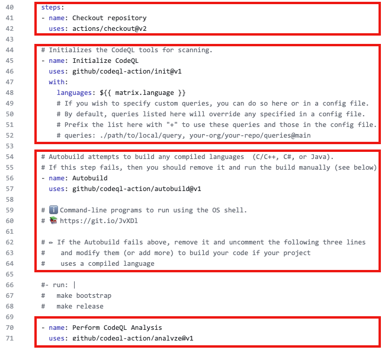

Please change `line 35` to only use `csharp` for this demonstration.

Click `Start Commit` -> `Commit this file` to commit the changes to the _main_ branch.

  

Workflow triggers

#### Workflow triggers

There are a [number of events](https://docs.github.com/en/free-pro-team@latest/actions/reference/events-that-trigger-workflows) that can trigger a GitHub Actions workflow. In this example, the workflow will be triggered on:

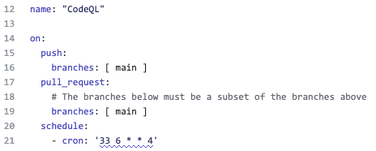

- push to the _main_ branch
- pull request to merge to the _main_ branch
- on schedule, at 6:33 every Thursday

Setting up the new CodeQL workflow and committing it to the _main_ branch in the step above will trigger the scan.

GitHub Actions Progress

 
#### GitHub Actions Progress

Click `Actions` tab -> `CodeQL`

Click the specific workflow run. You can view the progress of the Workflow run until the analysis completes.

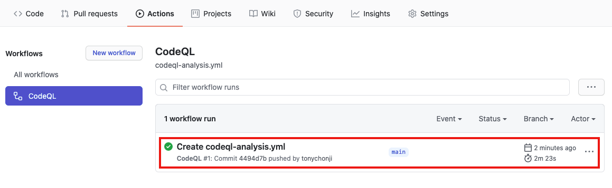

Security Issues

  
Once the Workflow has completed, click the `Security` tab -> ` Code Scanning Alerts`. You can see 29 alerts, select the first "Cross-site scripting" alert.

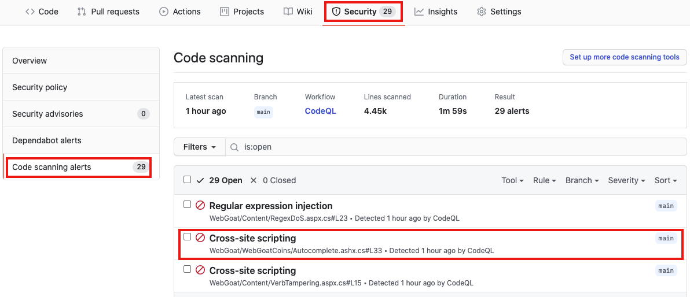

#### Security Alert View

Clicking on the security alert will provide details about the security alert including:

- A description of the issue
- A tag to the CWE that it is connected to as well as the type of alert (Error, Warning, Note)
- The line of code that triggered the security alert
- The ability to dismiss the alert depending on certain conditions (`False positive`? `Won't fix`? `Used in tests`?)

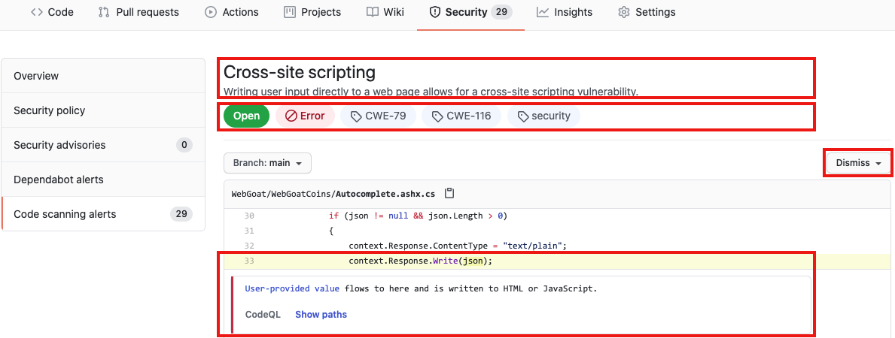

#### Security Alert Description

Click `Show more` to view a full desciption of the alert including examples and links to additional information.

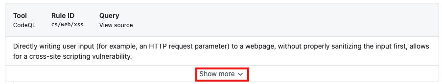

#### Security Full Description

Show Paths

#### Show Paths Button

CodeQL Analysis is able to trace the dataflow path from source to sink and gives you the ability to view the path traversal within the alert.

Click `show paths` in order to see the dataflow path that resulted in this alert.

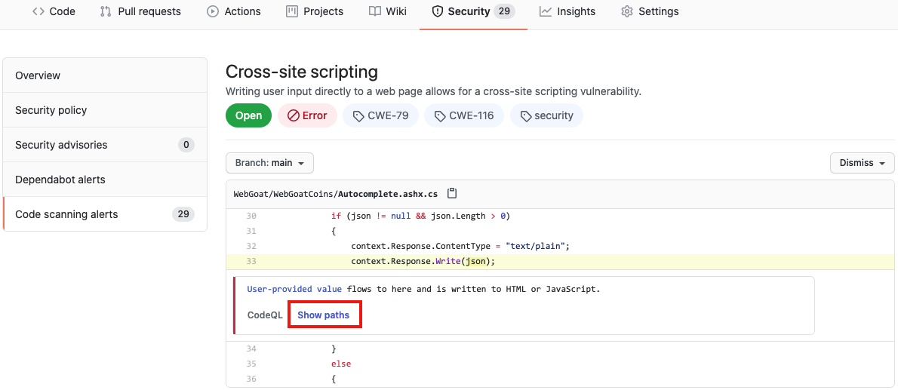

#### Show Paths View

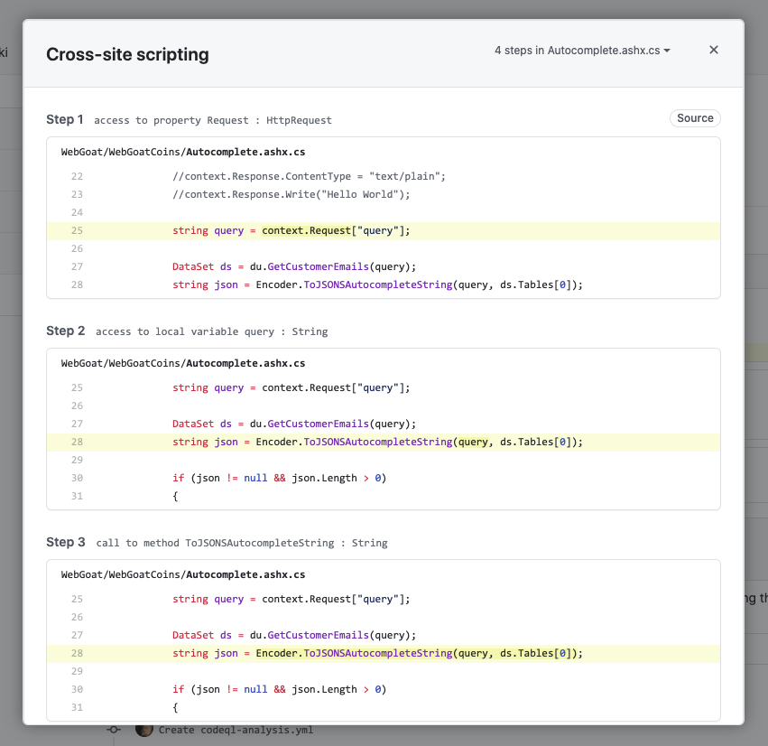

  
  

Fix the Security Alert

In order to fix this specific alert, we will need to ensure the content being write to the `HttpContext`'s response is validated and sanitized.

Click on the `Code` tab and [Edit](https://docs.github.com/en/free-pro-team@latest/github/managing-files-in-a-repository/editing-files-in-your-repository) the file [`Autocomplete.ashx.cs`](./WebGoat/WebGoatCoins/Autocomplete.ashx.cs) in the `WebGoat/WebGoatCoins` folder. For this demonstration purpose, we will simply write some hardcoded value to the `HttpContext` instance, this granatees the parameter is sanitized and safe.

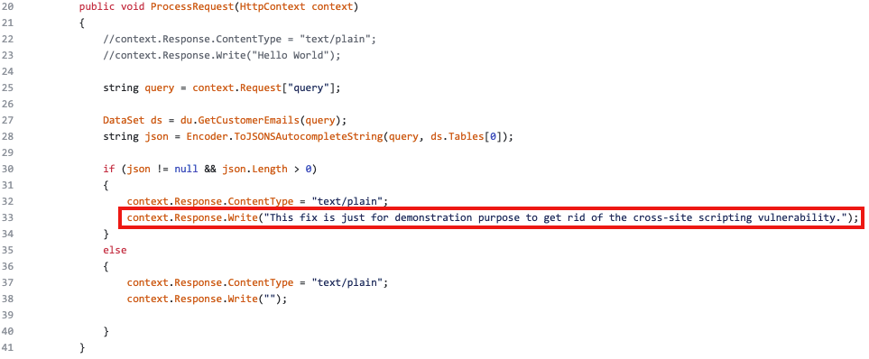

Click `Create a new branch for this commit and start a pull request`, name the branch `fix-cross-site-scripting`, and create the Pull Request.

#### Pull Request Status Check

In the Pull Request, you will notice that the CodeQL Analysis has started as a status check. Wait until it completes.

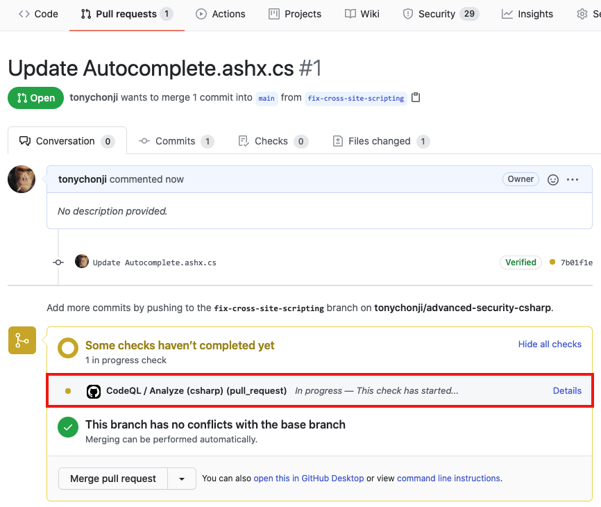

#### Security Alert Details

After the Workflow has completed click on `Details` by the `Code Scanning Results / CodeQL` status check. 

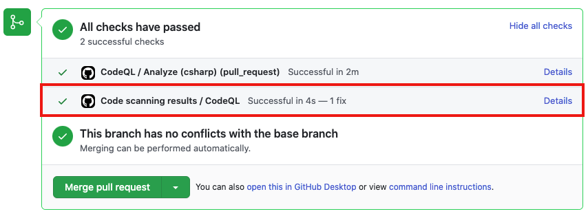

#### Fixed Alert

Notice that Code Scanning has detected that this Pull Request will fix the cross-site scripting vulnerability that was detected before.

Merge the Pull Request. After the Pull Request has been merged, another Workflow will kick off to scan the repository for any vulnerabilties. 

#### Closed Security Alerts

After the final Workflow has completed, navigate back to the `Security` tab and click `Closed`. Notice that the **Cross-site scripting** security alert now shows up as a closed issue.

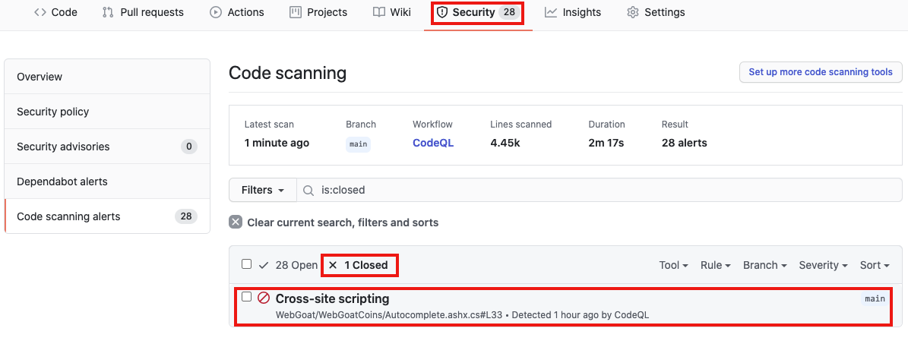

#### Traceability

Click on the security alert and notice that it details when the fix was made, by whom, and the specific commit. This provides full traceability to detail when and how a security alert was fixed and exactly what was changed to remediate the issue.

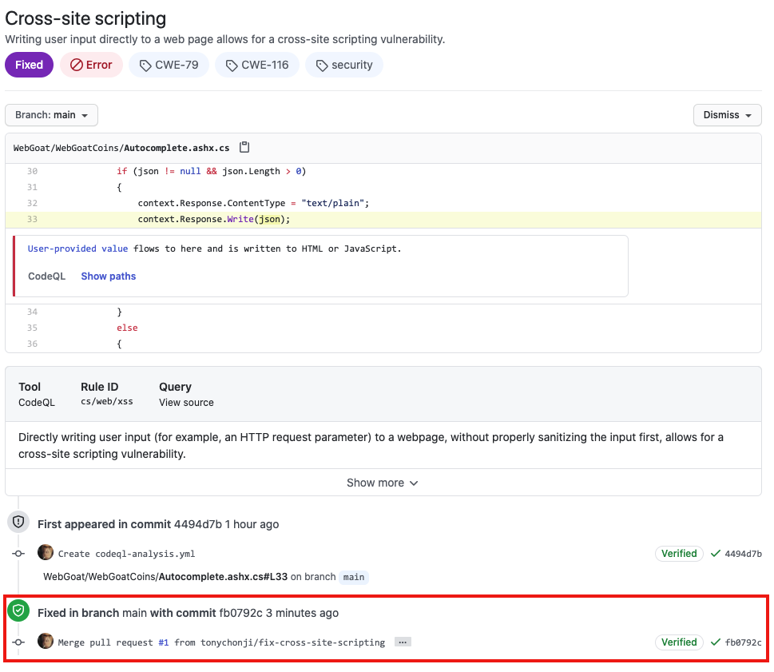

  
## Next Steps

Ready to talk about Advanced Security features for GitHub Enterprise? [Contact Sales](https://enterprise.github.com/contact) for more information!

Check out [GitHub's Security feature page](https://github.com/features/security) for more security features embedded into GitHub.

Check out the Code Scanning [documentation](https://docs.github.com/en/free-pro-team@latest/github/finding-security-vulnerabilities-and-errors-in-your-code/about-code-scanning) for additional configuration options and technical details.
